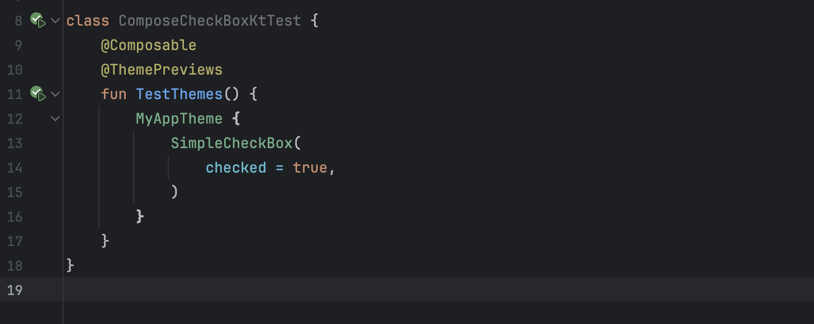
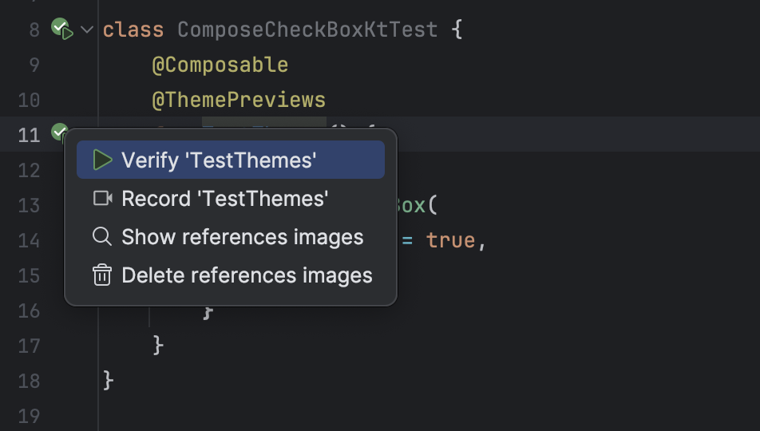
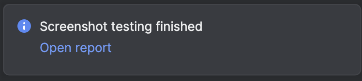

Compose Preview Screenshot Testing Plugin
========
[](https://github.com/alexandre-lefranc/compose-preview-screenshot-testing-intellij-plugin/actions/workflows/ci.yml)


Streamline your Compose Preview Screenshot Testing! This plugin lets you run all testing commands directly from Android Studio, boosting your productivity and simplifying your workflow.

Plugin features are: 
- Validate specific tests and show report
- Generate reference images from specific tests
- Show reference images
- Delete references images

All commands are available from modules, packages, test classes and preview methods and are based on the current build variant.






Installation
========

Download and install *Compose Preview Screenshot Testing* directly from Intellij / Android Studio:
`Preferences/Settings->Plugins->Browse Repositories`

Alternatively, you can [download the plugin](http://plugins.jetbrains.com/plugin/) from the jetbrains plugin site and install it manually in:
`Preferences/Settings->Plugins->Install plugin from disk`

Building / developing the plugin
========

```bash
# linux & macOS
./gradlew buildPlugin
# windows
gradlew buildPlugin
```

To test your development, use task `runIde` which will automatically run an Android Studio instance to test your new version of the plugin.
```bash
# linux & macOS
./gradlew runIde
# windows
gradlew runIde
```

License
=======

[MIT License Copyright (c) 2025 Alexandre Lefranc](LICENSE)
